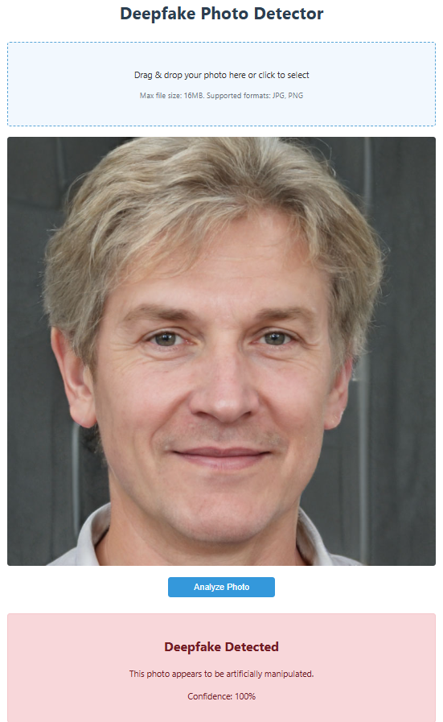
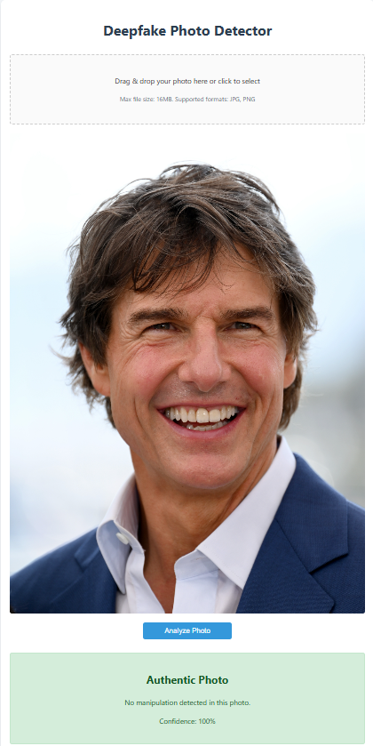

# 🕵️ DeepFake Detection Using InceptionResNetV2

This project implements a DeepFake detection system using the **InceptionResNetV2** architecture and transfer learning. The final model achieves an impressive **99.09%** accuracy on the test dataset.

---

## 📁 Dataset Structure

The dataset is organized as follows:

```
real-vs-fake/
├── train   → 100,000 images (real & fake)
├── valida  → 20,000 validation images
└── test    → 20,000 test images
```

✅ All images are resized to **224x224** pixels and normalized prior to training.

---

## 🧠 Model Architecture

**Final Architecture**:

1. **Base**: Pre-trained **InceptionResNetV2** (ImageNet weights)
2. **Top Layers**:

   * Dense layer (512 units) with **L2 regularization**
   * **BatchNormalization**
   * **Dropout** (rate = 0.5)
   * **Output layer** with **sigmoid** activation for binary classification

---

## 🏋️ Training Approaches

### ⚙️ Approach 1: Base Model Frozen

* Entire base frozen
* Used **LeakyReLU**
* **Exponential decay** learning rate (start: 1e-5)
* 🕒 Avg time/epoch: 109s
* 📊 Accuracy: \~79%

---

### 🔧 Approach 2: First Fine-Tuning

* First **450 layers frozen**
* Used **Adam** (LR: 1e-6)
* 🕒 Avg time/epoch: 112s
* 📉 Accuracy: \~74.4%

---

### 🚀 Approach 3: Advanced Fine-Tuning

* Same 450-layer freezing
* Switched to **ReLU**
* Increased LR to **0.0001**
* Enabled **early stopping** on val loss
* 🕒 Avg time/epoch: 164s
* ✅ Val Accuracy: **99.73%**
* ❗ Val Loss: **0.4831**

---

## ✅ Final Results

* 🎯 **Test Accuracy**: 99.09%
* 📉 **Test Loss**: 0.0292
* 📀 Model saved as: `final_inceptionresnetv2_deepfake_model_99.keras`

---

## 💻 Hardware Used

All experiments ran on an **NVIDIA A100 Tensor Core GPU** for high-speed training.

---

## 🧪 Sample Results

| Fake Detected  | Authentic      |
| -------------- | -------------- |
|  |  |

---

# 🔍 Post-Training Inference

Demonstrated in \[`Models/Post-Training Inference.ipynb`]\(Models/Post-Training Inference.ipynb), this notebook shows how to:

1. Load the trained model
2. Evaluate it on new datasets
3. Predict individual image authenticity with confidence scores

### 🧹 Features

* Reusable image prediction function
* Custom image support
* Visualization with `matplotlib`
* Confidence scoring & binary classification

### 🧠 Key Findings

* Model loads reliably
* Generalizes well to unseen data
* Predicts and visualizes results accurately
* ✅ Accuracy on new dataset: **94%**

---

# 🌐 Flask Web App Deployment

A user-friendly **web app** that detects DeepFakes in videos by analyzing extracted frames with the trained CNN.

### ⚙️ Features

* 🎥 Video upload interface
* 🗄️ Extracts 10 key frames
* 📉 Efficient JPEG compression
* 🧠 CNN-based frame analysis
* 📊 Displays final result with confidence

---

## ✨ Getting Started

### 📦 Prerequisites

* Python 3.8+
* pip

### 🛠️ Installation

```bash
git clone https://github.com/yourusername/DeepFake-Photos-Genrator.git
cd DeepFake-Photos-Genrator
pip install -r requirements.txt
```

### ▶️ Run the App

```bash
python app.py
```

🔗 App will run at: [http://localhost:5000](http://localhost:5000)

---

## 🧬 How It Works

1. **Upload** a short video
2. **Extract** 10 evenly spaced frames using OpenCV
3. **Compress** frames using Pillow
4. **Predict**:

   * Resize to 224x224
   * Normalize and input into the CNN
   * Average prediction scores
5. **Display** result + confidence percentage

---

## ⚙️ Tech Stack

* 🐍 **Flask** (Web Framework)
* 🎮 **OpenCV** (Frame Extraction)
* 🖼️ **PIL/Pillow** (Image Compression)
* 🧠 **TensorFlow** (Model)
* 🧳 In-memory processing (No DB required)

---

## ⚡ Optimizations

* Only 10 frames analyzed → faster
* Resized to 224x224 → efficient model input
* Lossless JPEG compression → memory saved
* One-time model load on startup
* No file storage → privacy + speed

---

## 🧑‍💻 Customization

Replace the model path in `app.py`:

```python
# Load your trained model
model = tf.keras.models.load_model('path_to_your_model')
```

---

## 📊 Future Improvements

* 🎥 The model was designed to analyze entire videos by extracting frames and predicting on each frame individually.
* ⚠️ However, for advanced video-level analysis, the model requires a **real-world video dataset** to generalize more effectively.
* 🚀 Future versions could include:

  * Fine-tuning on real-life video footage
  * Integration with more advanced video forensics tools

---

## 📂 Resources

* 🔗 [Training/Validation Dataset (Kaggle)](https://www.kaggle.com/datasets/xhlulu/140k-real-and-fake-faces)
* 🔗 [Evaluation Dataset (Kaggle)](https://www.kaggle.com/datasets/alaaeddineayadi/real-vs-ai-generated-faces)

---

## 📄 License

This project is licensed under the [MIT License](LICENSE)
